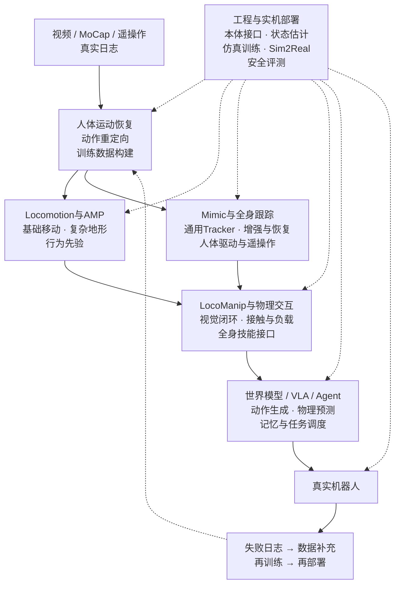
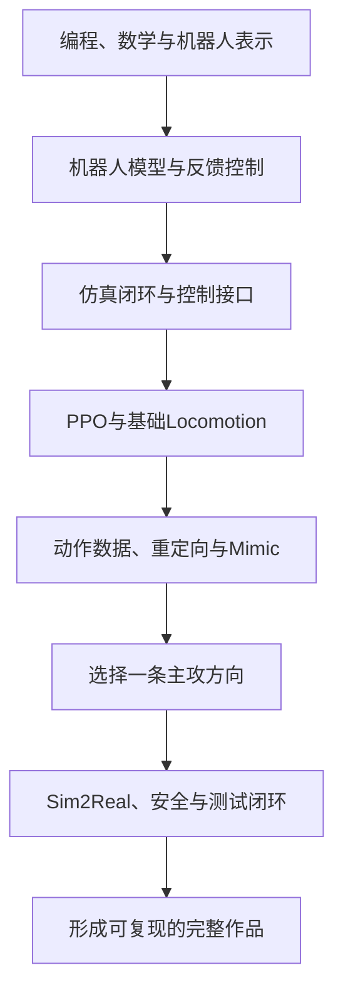

# 技术路线总览与新手学习路径

人形机器人运动智能可以沿一条连续研发链理解：动作数据先形成可用参考，Locomotion与动作跟踪分别建立身体能力，LocoManip把能力带入物理交互，世界模型、VLA与Agent再负责长时任务和技能调用；工程与实机部署贯穿全程。

本页分为两部分：前半部分回答完整系统由哪些技术环节组成，后半部分回答第一次学习时应该按什么顺序建立机器人模型、反馈控制、仿真训练和失败分析能力。

## 从数据到实机的完整闭环

这张图按“数据入口 → 身体能力 → 物理交互 → 上层调用 → 真实部署”组织主链路。Locomotion与Mimic是两条并行的身体能力路线，工程与实机部署为各阶段提供共同底座；真实机器人产生的失败日志继续回流到数据、训练和评测环节。

这不是要求所有系统严格串行经过每一层。世界模型、VLA与Agent可以直接调用Locomotion、Mimic或LocoManip形成的技能；AMP、Transformer、Diffusion等是实现方法，应继续作为技术标签，而不是反过来决定整套分类。

| 顺序 | 技术路线 | 核心问题 | 主要产物 |
| --- | --- | --- | --- |
| 1 | [动作数据与重定向](01_动作数据与重定向.md) | 人体、视频、MoCap或其他本体的运动，怎样变成目标机器人的可训练动作与交互数据？ | 世界坐标人体运动、目标本体参考轨迹、批量训练数据 |
| 2 | [Locomotion与运动先验](02_Locomotion与运动先验.md) | 机器人怎样获得基础移动、复杂地形适应，以及不依赖逐帧参考的动作分布与行为表示？ | 速度跟踪与地形策略、对抗运动先验、可提示行为模型 |
| 3 | [动作跟踪与全身控制](03_动作跟踪与全身控制.md) | 参考动作、关键点或人体实时信号，怎样稳定转换成机器人全身控制并处理失配与恢复？ | 通用Tracker、参考修正与恢复策略、人体驱动遥操作闭环 |
| 4 | [LocoManip](04_LocoManip.md) | 移动、平衡、接触和操作怎样在同一闭环中协同，并真正改变外部物体或场景状态？ | 搬运、推拉、开门、工具使用、柔顺接触与负载适应技能 |
| 5 | [世界模型、VLA与Agent](05_世界模型VLA与Agent.md) | 上层模型怎样理解视觉语言、预测环境变化、生成动作或调度技能，并与身体控制器形成闭环？ | 动作块、世界预测、技能图、空间记忆与重规划指令 |
| 6 | [工程与实机部署](06_工程与实机部署.md) | 算法怎样接入本体、估计状态、满足动力学与安全约束，并经过仿真、评测和部署进入真实机器人？ | 仿真训练环境、控制与优化模块、部署接口、数据集、Benchmark和测试标准 |

## 路线之间怎样连接

1. **动作数据与重定向**解决训练信号从哪里来，以及人体或其他本体的动作怎样变成机器人可用参考。
2. **Locomotion与运动先验**和**动作跟踪与全身控制**是两条并行的身体能力路线：前者更关注自主移动与动作分布，后者更关注显式参考的稳定执行。
3. **LocoManip**以外部物体或场景状态是否被改变为验收标准，把移动、全身控制、视觉和接触放进同一闭环。
4. **世界模型、VLA与Agent**通常不直接替代关节级控制，而是输出动作块、子目标或技能调用，并根据环境反馈更新计划。
5. **工程与实机部署**提供本体接口、状态估计、动力学控制、仿真、Sim2Real、安全评测和日志回归，使前五条路线能够落到真实机器人。

## 新手学习路线

这条路线面向第一次系统学习人形机器人运动控制的读者。它不按论文发布时间排列，也不要求先把所有数学和强化学习课程学完，而是围绕一个目标展开：逐步做出能够解释、复现、测试和定位失败的机器人控制闭环。

上半部分描述系统怎样组成，下面的学习路线描述人应该按什么顺序建立能力。真实系统可以从动作数据进入，再连接Locomotion、Mimic、LocoManip和上层模型；新手更适合先理解机器人模型、反馈控制和仿真接口，再进入强化学习、动作数据与复杂任务。

### 完成这条路线后应该具备什么

你至少应该能够：

1. 画出“传感器观测 → 状态处理 → 策略或控制器 → 关节目标/力矩 → 机器人 → 下一时刻观测”的完整闭环；
2. 说清楚一个项目的机器人模型、观测、动作、奖励、控制频率、训练信息和部署信息；
3. 跑通一个公开基线，并通过对照实验说明自己的修改解决了什么问题；
4. 把失败定位到数据、模型、观测、策略、控制、仿真、硬件或时序中的具体环节；
5. 用代码、配置、日志、指标和失败案例证明结果，而不是只展示一段成功视频。

### 学习顺序

这是一条建议顺序，不是固定课表。已经掌握机器人学或强化学习的读者可以从对应阶段开始，但不应跳过每一阶段的“通过标准”。会背算法并不等于已经具备控制系统能力。

### 第一阶段：补齐必要基础

#### 先学什么

- Linux基本操作、Git、Python，以及能够阅读和修改C++工程的基础；
- 向量、矩阵、坐标变换、旋转矩阵、四元数和李群李代数的基本用途；
- 概率、梯度优化和神经网络训练的基本概念；
- URDF/MJCF中的连杆、关节、自由度、质量、惯量、碰撞体和坐标系。

这里不要求先完成一整套数学证明。重点是能在代码和机器人模型里认出这些对象，并知道单位、坐标系、关节顺序和旋转约定为什么会直接改变控制结果。

#### 最小作品

读取一个URDF或MJCF模型，输出关节名称、关节限位和执行器顺序；再读取一段关节日志，画出目标位置、实际位置和误差曲线。额外完成一次欧拉角、旋转矩阵和四元数之间的转换，并验证正反变换是否一致。

#### 通过标准

给你一个“机器人动作方向反了、姿态旋转了90度、关节索引错位”的故障时，你能先检查坐标、单位和索引，而不是直接修改奖励函数。

### 第二阶段：理解机器人模型与反馈控制

#### 先学什么

- 前向运动学、逆运动学、雅可比矩阵和关节限位；
- 刚体动力学、重力、惯性、接触与摩擦的基本关系；
- 位置控制、力矩控制、PD、阻抗与导纳控制分别接收什么目标；
- IMU、编码器、足端接触和力传感器能够提供什么，哪些状态仍需估计；
- 控制周期、仿真步长、策略频率和电机内环频率为什么不能混为一谈。

#### 最小作品

在MuJoCo或其他刚体仿真器中完成单关节目标跟踪，再让双足或人形模型保持一个静态姿态。记录目标关节角、实际关节角、速度和控制输出，主动改变PD参数、控制频率或模型质量，观察抖动、迟滞和失稳怎样出现。

#### 通过标准

你能够解释策略输出的“目标关节位置”为什么不是电机最终力矩，以及动作怎样经过PD控制器作用到机器人。机器人倒下时，你能区分参考目标不合理、反馈增益不合适、接触模型异常和控制周期错误。

下一步进入[工程与实机部署](06_工程与实机部署.md)，先认识本体接口、状态估计和控制工具在系统中的位置。

### 第三阶段：建立仿真训练闭环

#### 先选一个主环境

- **MuJoCo**更适合先观察动力学、接触、执行器和控制循环；
- **Isaac Lab/Isaac Gym**更适合大规模并行强化学习训练。

第一次学习时不要同时维护多个仿真器。先在一个环境里形成可重复基线，再做Sim2Sim对照，否则模型、接口和算法问题会混在一起。

#### 建议基线

从[Humanoid-Gym](../论文与项目/论文逐篇解读/P015.md)及其[开源实现](../论文与项目/开源项目主表.md#r033)开始，沿着Isaac Gym训练、MuJoCo验证和实机接口追踪同一策略。再阅读[Learning to Walk in Minutes](../论文与项目/论文逐篇解读/P010.md)，理解GPU并行、地形课程与PPO训练吞吐怎样配合。

#### 最小作品

跑通一个站立或速度跟踪任务，保存机器人模型、训练配置、随机种子、观测和动作定义、奖励曲线与评估视频。修改一个可控因素，例如动作缩放、PD增益或一个奖励项，并用同一测试条件比较修改前后结果。

#### 通过标准

你能从代码中找到任务注册、环境配置、观测构造、动作下发、奖励函数、Actor、Critic、模型保存和推理入口，并回答哪些信息只在训练阶段提供给Critic，哪些信息部署时仍然存在。

### 第四阶段：真正理解PPO与Locomotion

#### 先学什么

- 状态、观测、动作、奖励和终止条件怎样构成控制任务；
- Actor和Critic为什么可以读取不同信息；
- 回报、优势估计、PPO裁剪、熵和批量更新分别影响什么；
- 速度指令、步态、平衡、能耗、平滑和接触奖励之间为什么会冲突；
- 课程学习、扰动和域随机化怎样改变训练数据分布。

不要把“会用PPO”理解成会调用训练脚本。真正需要掌握的是：观测为什么包含这些量、动作为什么选择这种接口、奖励怎样塑造行为，以及策略失败后应该修改数据分布、任务定义还是控制接口。

#### 最小作品

在固定机器人和测试集上完成一次受控消融。可以删除一组历史观测、改变一个奖励项或关闭一类随机化，但一次只改变一个主要变量。报告训练稳定性、速度误差、摔倒率、能耗或保护触发，而不是只比较最好的一段视频。

#### 通过标准

面对“策略能走但动作抖、速度跟不上、转弯摔倒或真机不稳定”时，你能提出能够区分原因的实验，而不是继续无目标地调奖励权重。

进一步阅读[Rapid Locomotion](../论文与项目/论文逐篇解读/P011.md)，观察命令课程与历史适应怎样服务高速运动；完整论文和项目见[Locomotion与运动先验](02_Locomotion与运动先验.md)。

### 第五阶段：进入动作数据、重定向与Mimic

Locomotion回答“机器人怎样自主移动”，Mimic回答“机器人怎样稳定执行给定参考动作”。进入动作跟踪前，需要先保证参考动作已经适配目标本体；否则策略会被迫追踪不可达、穿地或违反接触约束的目标。

#### 数据链路

1. 从MoCap、视频或人体实时信号获得人体运动；
2. 统一帧率、坐标系、根节点、旋转表示和接触信息；
3. 把人体关键体映射到机器人连杆，并处理比例、零位、限位、碰撞和足底高度；
4. 生成机器人参考轨迹，再由跟踪策略输出关节目标；
5. 使用跟踪误差、足滑、碰撞、限位和失败动作检查参考与策略各自的问题。

#### 建议基线

先阅读[GMR](../论文与项目/论文逐篇解读/P077.md)并使用其[开源项目](../论文与项目/开源项目主表.md#r046)理解关键体映射、静态对齐、局部缩放和两阶段IK。随后阅读[SONIC](../论文与项目/论文逐篇解读/P035.md)，理解大规模动作库、统一运动表示与实时全身策略怎样连接；SONIC更适合作为通用跟踪系统参照，不要求新手直接复现全部规模。

#### 最小作品

选择一段来源和许可清楚的动作，完成“原始动作 → 目标机器人重定向 → 仿真回放或策略跟踪”。保留原始与重定向结果，并报告足滑、碰撞、关节限位、速度违例和跟踪失败片段。

#### 通过标准

面对一个新动作或新本体时，你能判断需要修改的是骨架映射、坐标对齐、比例、接触、参考轨迹还是跟踪策略，而不是把所有误差都归为“策略没训好”。

### 第六阶段：选择一条主攻方向

完成基础闭环后再选择主线。每次只把一条路线做深，其他路线先理解接口。

#### Locomotion、复杂地形与AMP

适合希望研究行走、跑跳、地形适应、抗扰和行为先验的读者。建议从基础速度跟踪进入复杂地形，再阅读[AMP](../论文与项目/论文逐篇解读/P022.md)、[DreamWaQ](../论文与项目/论文逐篇解读/P125.md)和[BFM-Zero](../论文与项目/论文逐篇解读/P080.md)。需要区分任务奖励、动作先验、状态估计和行为潜变量各自在训练中解决的问题。

#### Mimic与全身运动控制

适合希望研究动作跟踪、通用Tracker、参考修正、抗扰恢复和人体实时驱动的读者。基础跟踪稳定后，再进入[BeyondMimic](../论文与项目/论文逐篇解读/P034.md)这类参考修正与生成控制工作。验收重点是未见动作、动力学失配、碰撞扰动和偏离参考后的恢复，而不只是训练动作上的平均误差。

#### 动作数据与重定向

适合希望构建视频/MoCap恢复、跨本体映射、遥操作和批量训练数据管线的读者。重点作品应展示输入格式、坐标与接触处理、质量检查、许可边界以及下游策略是否真正受益，而不是只生成视觉上流畅的动画。

#### LocoManip与物理交互

适合希望把移动、平衡、视觉、接触和操作放进同一系统的读者。进入前应至少掌握一种稳定身体控制接口，并能获得物体状态或视觉反馈。作品需要明确物体状态怎样进入策略、接触怎样处理、成功条件怎样定义，以及失败后怎样恢复。完整路线见[LocoManip](04_LocoManip.md)。

#### 世界模型、VLA与Agent

适合研究视觉语言输入、未来预测、动作生成和技能调度的读者。不要把它当作跳过低层控制的捷径。需要先说清上层模型输出的是关节动作、动作块、末端目标还是技能调用，以及下层Locomotion、Mimic或LocoManip控制器怎样执行并返回反馈。完整路线见[世界模型、VLA与Agent](05_世界模型VLA与Agent.md)。

### 第七阶段：完成Sim2Real与测试闭环

#### 上机前必须检查什么

- 训练端、导出模型和运行时的关节顺序、零位、方向、单位与归一化是否一致；
- 机器人质量、惯量、摩擦、执行器、传感器、PD参数和时延是否有测量依据；
- 策略频率、通信频率和电机内环怎样衔接，超时和丢包怎样处理；
- 安全状态机、限位、急停、保护姿态和回滚版本是否已经准备；
- 日志是否使用统一时钟，并能重放失败前后的观测、动作和控制输出。

域随机化不是范围越宽越好。优先根据辨识结果、机器人个体差异和日志中的真实误差设定范围，再用消融检查它带来的收益和性能代价。

#### 没有真机怎么办

可以完成Sim2Sim、模型导出一致性、延迟注入、传感器噪声、参数扫描、故障回放和硬件在环方案设计，但必须明确这些证据不能替代真实机器人测试。

#### 最小作品与通过标准

建立一份固定测试矩阵，覆盖速度、地面、扰动、载荷、延迟和模型偏差。一次失败必须能够定位到版本、机器人或仿真模型、场景和时间窗口；每次修复都要增加能够重新触发旧问题的回归用例。工程细节继续阅读[工程与实机部署](06_工程与实机部署.md)。

### 最终作品应该包含什么

一份有说服力的作品不需要覆盖所有技术路线，但应完整覆盖自己选择的问题：

1. **问题与边界**：机器人、任务、场景、输入输出和成功条件；
2. **可复现环境**：代码版本、依赖、模型、数据许可、配置和运行命令；
3. **控制闭环**：观测、动作、奖励、网络或优化器、PD/WBC接口与频率；
4. **基线与改动**：原始方法、自己的修改，以及为什么这样修改；
5. **实验与消融**：固定测试条件、多个随机种子或重复测试、关键指标；
6. **失败分析**：代表性失败、原因假设、验证实验和未解决问题；
7. **部署证据**：Sim2Sim、真机或仅仿真的明确边界；
8. **结果表达**：曲线、日志、视频和结论相互对应，不选择性展示单次成功。

完成标志不是“跑通某个开源项目”，而是换一段动作、一个机器人模型、一组控制参数或一个测试场景后，你仍然知道系统哪些部分需要修改、怎样验证，以及结果能支持什么结论。

### 根据自己的起点进入

- **没有强化学习和机器人基础**：从第一阶段开始，先做关节日志和PD闭环，再进入并行仿真训练。
- **会深度学习但不懂机器人**：不要直接从VLA或策略网络开始；从第二阶段补机器人模型、接触和控制接口。
- **有经典控制或机器人背景**：从第三阶段进入公开训练基线，重点补PPO、数据分布和学习策略的失败分析。
- **已经跑过开源项目**：直接按每阶段的通过标准补证据；不能回答观测、动作、奖励、频率和部署接口时，仍需回到相应阶段。

### 常见的无效学习方式

- 同时学习多个仿真器和多个代码库，最后无法判断问题来自哪里；
- 只运行作者命令，不追踪任务注册、观测、动作、奖励和部署入口；
- 把持续调奖励当成主要研究方法，却没有检查坐标、控制接口和数据分布；
- 直接追逐VLA、世界模型或新模型名称，没有先定义它与低层控制器的接口；
- 只保存成功视频，不保存配置、日志、失败样本和测试条件；
- 用一次仿真或真机成功声称“稳定、通用或完成Sim2Real”。

### 继续查资料

- 不清楚各路线在系统中的位置：回到[本页技术总览](#从数据到实机的完整闭环)；
- 已知论文名称或稳定ID：进入[论文总索引](../论文与项目/README.md)；
- 需要代码和复现入口：进入[开源项目主表](../论文与项目/开源项目主表.md)；
- 已经确定方向：进入[动作数据与重定向](01_动作数据与重定向.md)、[Locomotion与运动先验](02_Locomotion与运动先验.md)、[动作跟踪与全身控制](03_动作跟踪与全身控制.md)、[LocoManip](04_LocoManip.md)、[世界模型、VLA与Agent](05_世界模型VLA与Agent.md)或[工程与实机部署](06_工程与实机部署.md)。
